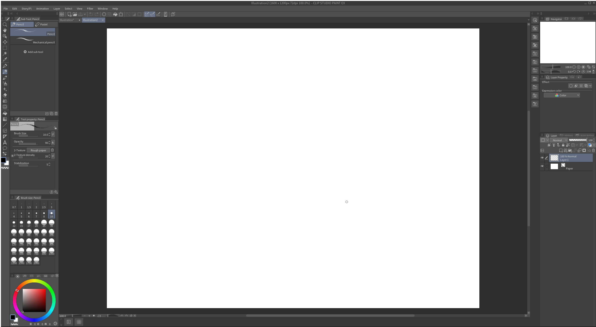

# Clip Studio Paint on Linux



These notes cover one working setup for Clip Studio Paint EX 1.13.2 on Debian 13, using Wine 10.0. They are based on my own installation. Clip Studio Paint does not officially support Linux, and this setup can behave differently on another distribution, Wine version, GPU, tablet or license.

The installer is not included here. Download it from [Celsys](https://www.clipstudio.net/en/dl/v1/) and use a license you own. This project does not bypass activation or bundle Clip Studio Paint.

## Tested setup

- MX Linux based on Debian 13 (trixie)
- Wine 10.0, 64-bit prefix
- Clip Studio Paint EX 1.13.2 (`CSP_1132w_setup.exe`)
- XP-Pen Deco LW (IT1060B), detected by Linux as a pen, mouse and pad device

I selected Wintab in Clip Studio Paint's tablet preferences and enabled “Use mouse mode in tablet driver settings.” That is the setting used on this machine; it is not a guarantee that every tablet will behave the same way.

## Before you start

Install Wine, Winetricks, `curl`, `ca-certificates`, and `sha256sum` using your distribution's package manager. On Debian or Ubuntu, the package names are usually:

```sh
sudo apt update
sudo apt install wine winetricks curl ca-certificates coreutils
```

Use a current distribution Wine build. This script was written against Wine 10.0 and Winetricks on Debian 13; other combinations have not been checked here. It downloads Wine Gecko from WineHQ and verifies both MSI files against pinned SHA-256 checksums before installing them.

## Install

Download the Windows installer from Celsys. For the tested release, the filename is `CSP_1132w_setup.exe`. Then run:

```sh
./install.sh ~/Downloads/CSP_1132w_setup.exe
```

The script creates an isolated 64-bit prefix at:

```text
~/.local/share/wineprefixes/csp-ex-1.13.2
```

It configures Windows 8.1 compatibility, installs the Visual C++ 2010 runtime and CJK fonts, adds Wine Gecko, and opens the Celsys installer. Finish the installation in its window. When it completes, the script installs a launcher at `~/.local/bin/clip-studio-paint-ex` and a desktop-menu entry.

Start Paint from your desktop's application menu, or run:

```sh
~/.local/bin/clip-studio-paint-ex
```

The script stops if that prefix already exists, to avoid changing or overwriting an existing Wine environment. To start over, move or remove that directory yourself after backing up any work and settings stored there.

## Activation and online features

Use Clip Studio's normal license activation. Celsys documents an offline activation process for perpetual Ver. 1 licenses [here](https://support.clip-studio.com/en-us/faq/articles/20210006). It requires your valid serial number and a separate internet-connected device. Do not put serial numbers or account credentials in this repository or its issue tracker.

In my Wine setup, the main Paint interface opens, but the embedded Clip Studio page reports that it is offline. Linux itself can reach the Clip Studio website. Treat the embedded online services, account sign-in, asset store and cloud features as unverified; this guide does not fix or promise those services.

## Tablet notes

The Deco LW appeared in `lsusb` as `28bd:0935` and Linux exposed pen, mouse and pad inputs. The steps above use Wintab and the mouse-mode option in Clip Studio Paint. If input or pressure does not work, check your tablet driver's settings and the official [XP-Pen Deco LW downloads](https://www.xp-pen.com/download/deco-lw.html). Driver support varies by distribution and tablet model.

## Known limitations

- Celsys lists Windows and macOS, not Linux, in its [desktop system requirements](https://support.clip-studio.com/en-us/faq/articles/20250002). Wine compatibility is unofficial and may break after application, Wine or system updates.
- The tested release is the Windows Ver. 1.13.2 installer. Other Clip Studio Paint versions and editions are untested by this repository.
- The embedded online page reported offline on the tested machine. Activation, cloud sync, asset downloads and other web-backed features may not work.
- Tablet discovery by Linux does not guarantee pressure sensitivity, buttons, mapping or calibration in Paint.
- Do not run the installer as root. Keep the prefix dedicated to Clip Studio Paint and back it up before changing Wine components.

## What the script changes

`install.sh` creates a Wine prefix under your user data directory, downloads two Wine Gecko MSI packages to the user cache, installs Winetricks components into that prefix, and writes a launcher and desktop entry in your home directory. It does not install system packages, download the proprietary Paint installer, activate a license, or modify other Wine prefixes.

## References

- [Celsys: Clip Studio Paint Ver. 1 download](https://www.clipstudio.net/en/dl/v1/)
- [Celsys: desktop system requirements](https://support.clip-studio.com/en-us/faq/articles/20250002)
- [Celsys: offline activation for perpetual Ver. 1 licenses](https://support.clip-studio.com/en-us/faq/articles/20210006)
- [WineHQ Gecko downloads](https://dl.winehq.org/wine/wine-gecko/2.47.4/)
- [Community guide for Clip Studio Paint 1.13.2 on Linux](https://github.com/pomcomic/CSP-on-Linux)
